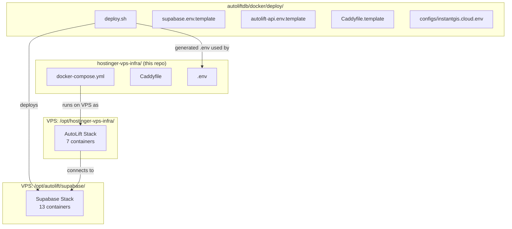
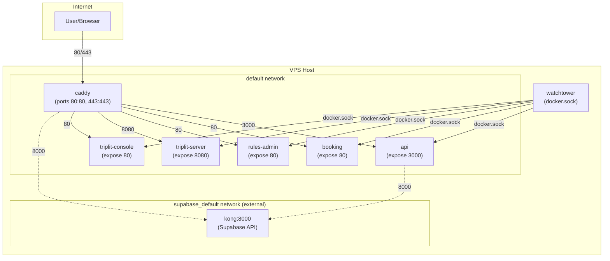
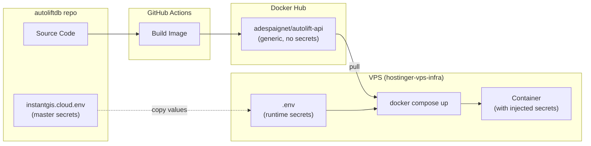
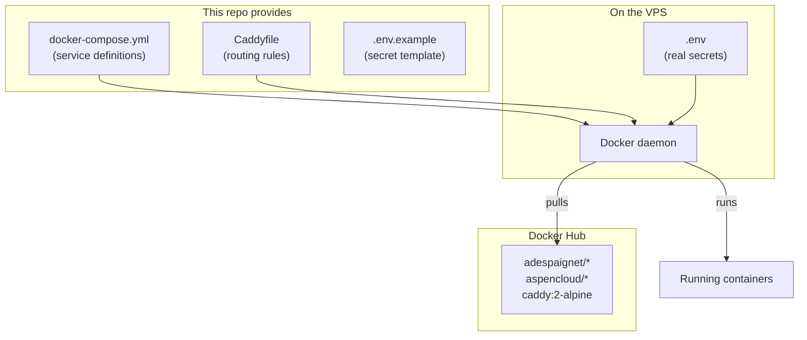
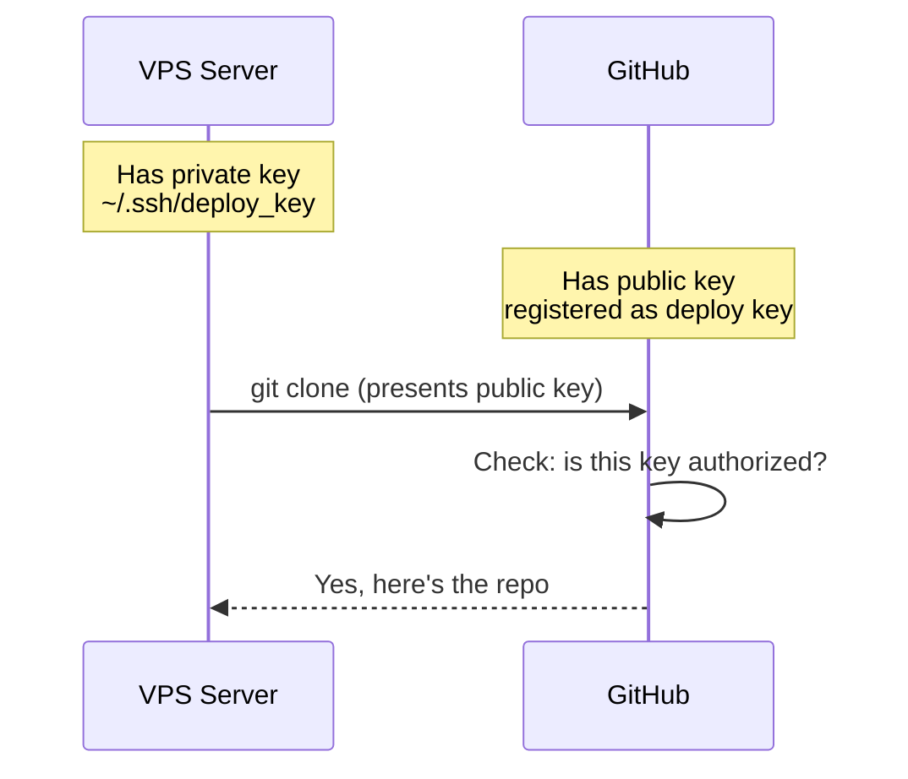
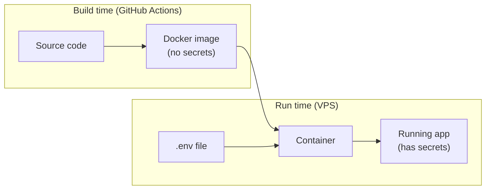
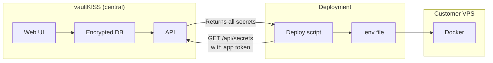
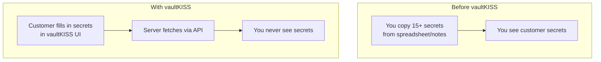

# Frequently Asked Questions

*A collection of questions and answers about this project.*

---

## What is this repo and how does it relate to autoliftdb/docker/deploy?

There are **two deployment systems** that work together:

| Repo/Location | What it manages | Where on VPS |
|---------------|-----------------|--------------|
| `autoliftdb/docker/deploy/` | **Supabase stack** (13 containers) | `/opt/autolift/supabase/` |
| `hostinger-vps-infra/` (this repo) | **AutoLift stack** (7 containers) | `/opt/hostinger-vps-infra/` |

### Why two repos?

1. **autoliftdb/docker/deploy/** was created first - it has `deploy.sh` that handles full customer deployments (Supabase + AutoLift + secrets generation)

2. **hostinger-vps-infra/** was created later to separate your **home VPS topology** from the multi-customer deployment system

### Current VPS state (verified working)

```
/opt/
├── autolift/
│   └── supabase/           # Supabase stack (deployed by autoliftdb/docker/deploy/)
│       ├── .env            # supabase.env
│       ├── docker-compose.yml
│       └── volumes/
│
└── hostinger-vps-infra/    # AutoLift stack (this repo)
    ├── .env                # autolift-api.env
    ├── Caddyfile
    └── docker-compose.yml
```

Both stacks share the `supabase_default` network so AutoLift can reach Supabase via `kong:8000`.

### Which to use when?

| Task | Use |
|------|-----|
| Deploy to **new customer VPS** | `autoliftdb/docker/deploy/deploy.sh` (does everything) |
| Change **your home VPS AutoLift config** | This repo (`hostinger-vps-infra`) |
| Update **Supabase on your home VPS** | `autoliftdb/docker/deploy/` templates + redeploy |

### The relationship



---

## What is the docker-compose.yml for and what services does it define?

The `docker-compose.yml` defines the **AutoLift API Stack** - a set of containerized services that run together on the VPS. It handles reverse proxying, the API, frontend apps, and automatic deployments.

### Services defined:

| Service | Image | Purpose |
|---------|-------|---------|
| **caddy** | `caddy:2-alpine` | Reverse proxy with automatic HTTPS (ports 80/443) |
| **api** | `adespaignet/autolift-api` | Fastify API backend (port 3000 internal) |
| **booking** | `adespaignet/autolift-booking` | Angular frontend for booking demo site |
| **rules-admin** | `adespaignet/autolift-rules-admin` | React app for GoRules management |
| **triplit-server** | `aspencloud/triplit-server` | Real-time sync database (for casela-audiofence) |
| **triplit-console** | `adespaignet/triplit-console` | Admin UI for Triplit |
| **watchtower** | `containrrr/watchtower` | Auto-pulls new images from Docker Hub |

### Key patterns used:

- **`expose` vs `ports`**: Services use `expose` (internal only) while Caddy uses `ports` (public). Caddy is the only entry point.
- **Networks**: Two networks - `default` for inter-service communication, `supabase_default` (external) to reach Supabase.
- **Volumes**: Persistent storage for Caddy certificates (`caddy_data`), config, and Triplit database.
- **Environment variables**: Pulled from `.env` file (see `.env.example`).
- **Healthchecks**: API and Triplit have wget-based health checks.
- **Labels**: `com.centurylinklabs.watchtower.enable=true` tells Watchtower which containers to auto-update.

### Deployment flow:

1. Push to main -> GitHub Actions builds image -> Docker Hub
2. Watchtower detects new image (polls every 5 min) -> pulls and restarts container

---

## What makes Caddy the only entry point?

The difference between `ports` and `expose`:

```yaml
# Caddy - exposes to the HOST (and internet)
caddy:
  ports:
    - "80:80"
    - "443:443"

# API - only visible inside Docker network
api:
  expose:
    - "3000"
```

- **`ports: "80:80"`** - Maps host port to container port. Traffic from the internet on port 80/443 reaches Caddy.
- **`expose: "3000"`** - Makes the port available only within the Docker network. No outside access possible.

The VPS firewall allows 80/443 inbound. Those hit Caddy. Caddy then routes internally to services by container name (e.g., `http://api:3000`). The other services are invisible to the outside world.

---

## Network topology diagram



- **Solid arrows**: HTTP traffic flow
- **Dashed arrows**: Cross-network connections (to Supabase) and Watchtower's docker.sock access
- Only **caddy** has `ports` (exposed to host/internet)
- **api** and **caddy** are on both networks (can reach Supabase's Kong)

---

## Why don't exposed ports clash? (booking, rules-admin, triplit-console all expose 80)

`expose` doesn't bind to the host - it just declares what port the container listens on internally. Each container has its own network namespace (its own IP address on the Docker network).

Think of it like apartments in a building. Every apartment can have a door numbered "80". You reach them by address:

```
http://booking:80
http://rules-admin:80
http://triplit-console:80
```

These are three different endpoints. Caddy knows which one to route to based on the domain/path in the request.

`ports` would clash because that binds to the **host's** single IP. You can't have two services both grab host port 80.

---

## What is docker.sock?

`/var/run/docker.sock` is the Unix socket the Docker daemon listens on. It's the API endpoint for controlling Docker.

```yaml
watchtower:
  volumes:
    - /var/run/docker.sock:/var/run/docker.sock
```

Mounting it into a container gives that container full access to the Docker API - it can:
- List running containers
- Pull new images
- Stop/start/restart containers
- Read container labels and config

Watchtower uses this to monitor containers labeled with `com.centurylinklabs.watchtower.enable=true`, check Docker Hub for new image versions, and restart containers with the updated image.

**Security note**: Any container with docker.sock access effectively has root on the host. Only give it to trusted images.

---

## What is `com.centurylinklabs.watchtower.enable=true`?

Docker labels are key-value metadata you can attach to containers. They don't affect the container's behavior directly - they're just tags that other tools can read.

```yaml
api:
  labels:
    - "com.centurylinklabs.watchtower.enable=true"
```

The naming convention `com.centurylinklabs.watchtower.*` is reverse-DNS style (like Java packages) to avoid collisions. CenturyLink Labs created Watchtower.

Watchtower has a setting:

```yaml
watchtower:
  environment:
    - WATCHTOWER_LABEL_ENABLE=true   # Only update containers with the label
```

With this enabled, Watchtower queries Docker: "give me all containers where `com.centurylinklabs.watchtower.enable=true`" and only monitors those.

**Why opt-in?** You might have containers you don't want auto-updated:
- Database containers (risky to auto-update)
- Third-party images you want to control manually
- Containers with complex migration needs

In this stack:

| Service | Has Watchtower label? | Why? |
|---------|----------------------|------|
| api | Yes | Your code, auto-deploy on push |
| booking | Yes | Your code, auto-deploy on push |
| rules-admin | Yes | Your code, auto-deploy on push |
| triplit-server | Yes | Auto-update to latest |
| triplit-console | Yes | Your code, auto-deploy on push |
| caddy | **No** | Stable infra, update manually |
| watchtower | **No** | Stable infra, update manually |

So 5 out of 7 services are auto-updated. Caddy and Watchtower are infrastructure that you'd update deliberately.

---

## Where do the Docker images come from?

Each service pulls its image from Docker Hub. Some are public/official images, some are from your account (`adespaignet`):

| Service | Image | Source |
|---------|-------|--------|
| caddy | `caddy:2-alpine` | Official Caddy image |
| api | `adespaignet/autolift-api:latest` | Your Docker Hub |
| booking | `adespaignet/autolift-booking:latest` | Your Docker Hub |
| rules-admin | `adespaignet/autolift-rules-admin:latest` | Your Docker Hub |
| triplit-server | `aspencloud/triplit-server:latest` | Aspen Cloud (Triplit vendor) |
| triplit-console | `adespaignet/triplit-console:latest` | Your Docker Hub (custom build) |
| watchtower | `containrrr/watchtower:latest` | Watchtower maintainers |

**Your images** (`adespaignet/*`) are built by GitHub Actions on push to main, then pushed to Docker Hub. Watchtower polls and pulls them.

**Third-party images** are maintained by their vendors. Watchtower will also update these if they have the label (triplit-server does).

---

## Caddyfile structure

The Caddyfile is built from modular snippets in `caddy/`:

| File | Purpose |
|------|---------|
| `caddy/Caddyfile.core` | AutoLift core services (api, booking, rules, supabase, studio) |
| `caddy/Caddyfile.triplit` | Triplit services (optional) |
| `Caddyfile` (root) | **Generated output** - mounted into container |

Both snippets use `{{PLACEHOLDERS}}` for domain and credentials:
- `{{DOMAIN}}` - e.g., `instantgis.cloud`
- `{{DASHBOARD_USERNAME}}` - Supabase Studio username
- `{{DASHBOARD_PASSWORD_HASH}}` - bcrypt hash for basic auth

### Generating the Caddyfile

**AutoLift only (customer VPS):**
```powershell
(Get-Content caddy/Caddyfile.core) `
    -replace '\{\{DOMAIN\}\}', 'customer.com' `
    -replace '\{\{DASHBOARD_USERNAME\}\}', 'admin' `
    -replace '\{\{DASHBOARD_PASSWORD_HASH\}\}', '$2a$14$...' |
    Set-Content Caddyfile
```

**AutoLift + Triplit (your VPS):**
```powershell
(Get-Content caddy/Caddyfile.core, caddy/Caddyfile.triplit) `
    -replace '\{\{DOMAIN\}\}', 'instantgis.cloud' `
    -replace '\{\{DASHBOARD_USERNAME\}\}', 'supabase' `
    -replace '\{\{DASHBOARD_PASSWORD_HASH\}\}', '$2a$14$B.TYWYOS2RVP...' |
    Set-Content Caddyfile
```

The docker-compose mounts the generated file:
```yaml
caddy:
  volumes:
    - ./Caddyfile:/etc/caddy/Caddyfile:ro
```

---

## How do Docker Compose profiles work?

Profiles let you mark services as optional. In `docker-compose.yml`:

```yaml
services:
  api:
    image: adespaignet/autolift-api:latest
    # No profile = always runs

  triplit-server:
    profiles:
      - triplit    # Only runs when profile is activated
```

**Deploy AutoLift only (customer VPS):**
```bash
docker compose up -d
```

**Deploy AutoLift + Triplit (your VPS):**
```bash
docker compose --profile triplit up -d
```

This is now implemented in `docker-compose.yml`. The `triplit-server` and `triplit-console` services have `profiles: [triplit]`.

---

## How are .env variables in this repo related to .env in autoliftdb?

They serve different purposes at different stages:

### Build time (autoliftdb repo + GitHub Actions)

When GitHub Actions builds an image (e.g., `adespaignet/autolift-api`):
- Uses `.env` or secrets in **autoliftdb** for build-time config
- These are things like Node version, build flags, etc.
- **Secrets are NOT baked into the image** - images are generic

The image is a "blank" artifact pushed to Docker Hub. It doesn't know what Supabase URL or API keys to use.

### Runtime (this repo + VPS)

When the container runs on the VPS:
- `docker-compose.yml` references `${SUPABASE_URL}`, `${WEBHOOK_SECRET}`, etc.
- Docker Compose reads `.env` in **this repo** (on the VPS) and injects them
- The container receives these as environment variables at startup



### The relationship

| Stage | Repo | .env purpose |
|-------|------|--------------|
| Build | autoliftdb | Build flags, CI config (no secrets in image) |
| Deploy config | autoliftdb | `docker/deploy/configs/instantgis.cloud.env` = master secrets |
| Runtime | hostinger-vps-infra | `.env` on VPS = subset of master secrets for this stack |

The master config in autoliftdb (`instantgis.cloud.env`) contains **everything**. You copy the relevant values to `.env` in this repo on the VPS. They're the same values, just in two places for different purposes:
- Master config: single source of truth, used to generate Supabase config too
- VPS .env: what Docker Compose actually reads at runtime

---

## If I deploy to a customer VPS, am I leaking Triplit secrets?

Yes, if you copy your full `.env` to a customer VPS, they'd have `TRIPLIT_JWT_SECRET` and `TRIPLIT_EXTERNAL_JWT_SECRET` even though those services won't run (profiles aren't activated).

**Solutions:**

### Option 1: Separate .env templates

Keep two templates:
- `.env.example` - AutoLift core only (for customers)
- `.env.example.full` - Core + Triplit (for your VPS)

### Option 2: Remove from .env.example entirely

Triplit vars shouldn't be in `.env.example` at all since Triplit is optional. Only add them manually on your VPS.

### Option 3: Generate per-deployment .env

Your deploy script in autoliftdb should generate `.env` with only the variables needed for that deployment. Customer deployments skip Triplit vars entirely.

**Recommended:** Option 2 or 3. The `.env.example` should only contain what's required for the core AutoLift stack. Triplit is a bolt-on for your personal VPS.

This also applies to `Caddyfile` generation - customer deployments use only `Caddyfile.core`, yours uses both snippets.

### Environment variables

Two sources:

| Source | What | Where |
|--------|------|-------|
| `autoliftdb/docker/deploy/configs/instantgis.cloud.env` | Master config with ALL secrets | In autoliftdb repo (private) |
| `.env` on VPS | Runtime secrets for docker-compose | Only on VPS, never in Git |

**Flow:**
1. Master config generated once by `generate-secrets.sh` in autoliftdb
2. Manually copy relevant values from master config to `.env` on VPS
3. `docker-compose.yml` reads `.env` via `${VARIABLE}` syntax

This repo has `.env.example` showing the shape:
```
SUPABASE_URL=CHANGE_ME
SUPABASE_SERVICE_ROLE_KEY=CHANGE_ME
...
```

On the VPS, you create a real `.env` with actual values. Docker Compose automatically loads it.

---

## What happens when I commit and push this repo?

**Nothing automatic.** This repo is infrastructure-as-code, but there's no CI/CD pipeline watching it.

When you push to GitHub:
1. Code is stored on GitHub (backup, version control)
2. That's it - nothing deploys automatically

### What does this repo actually do on a VPS?

This repo defines the **topology** - what runs where. On a VPS you:

1. **Clone once**: `git clone` this repo to `/opt/hostinger-vps-infra`
2. **Create `.env`**: Copy `.env.example` to `.env`, fill in real secrets
3. **Generate Caddyfile**: Run the PowerShell command to substitute placeholders
4. **Start the stack**: `docker compose up -d`



### The actual deployment flow

| What | Triggers deployment | How |
|------|---------------------|-----|
| **App code changes** (API, frontend) | Push to `autoliftdb` main | GitHub Actions builds image → Docker Hub → Watchtower pulls & restarts |
| **Infra changes** (new service, port, env var) | Push to this repo | Manual: SSH to VPS, `git pull`, `docker compose up -d` |

So:
- **Day-to-day code changes**: Automatic via Watchtower (you just push to autoliftdb)
- **Infrastructure changes**: Manual intervention required (SSH, pull, restart)

### Why not automate infra deploys?

Infra changes are rare and risky. You want to:
- Review before applying
- Be present if something breaks
- Not accidentally take down production

For a single VPS, manual `docker compose up -d` is fine.

---

## How do I clone a private repo on a server? (Deploy Keys)

`hostinger-vps-infra` is private. The server needs permission to access it.

### What is a deploy key?

A deploy key is an SSH keypair where:
- **Private key** lives on the server (secret, never shared)
- **Public key** is registered with GitHub on a specific repo

When the server tries to `git clone` or `git pull`, GitHub checks: "Does this server's key match one I know?" If yes, access granted.

**Key point:** A deploy key only works for ONE repo. It can't access your other repos or your GitHub account. Safe to use on customer servers.

### How it works (diagram)



### Step-by-step setup

**1. On the server, generate a keypair:**

```bash
ssh-keygen -t ed25519 -C "deploy@instantgis-vps" -f ~/.ssh/deploy_key -N ""
```

This creates:
- `~/.ssh/deploy_key` (private - stays on server)
- `~/.ssh/deploy_key.pub` (public - goes to GitHub)

**2. Copy the public key:**

```bash
cat ~/.ssh/deploy_key.pub
```

Output looks like: `ssh-ed25519 AAAAC3Nz... deploy@instantgis-vps`

**3. Add to GitHub:**

Go to: https://github.com/instantgis/hostinger-vps-infra/settings/keys
- Click "Add deploy key"
- Title: `instantgis-vps` (or customer name)
- Key: paste the public key
- Leave "Allow write access" unchecked (read-only is fine)

**4. Clone using the deploy key:**

```bash
GIT_SSH_COMMAND="ssh -i ~/.ssh/deploy_key" git clone git@github.com:instantgis/hostinger-vps-infra.git /opt/hostinger-vps-infra
```

**5. For future pulls, set it permanently:**

```bash
cd /opt/hostinger-vps-infra
git config core.sshCommand "ssh -i ~/.ssh/deploy_key"
```

Now `git pull` will just work.

### For customer servers

Each customer server gets its own deploy key. You can:
- Use the same repo (add multiple deploy keys, name them by customer)
- Or create customer-specific repos (cleaner separation)

If you revoke a deploy key in GitHub, that server loses access immediately.

---

## What are DASHBOARD_USERNAME and DASHBOARD_PASSWORD_HASH in the Caddyfile?

These protect `studio.<DOMAIN>` with HTTP Basic Auth - an extra layer so random people can't access Supabase Studio.

| Placeholder | Purpose |
|-------------|---------|
| `{{DASHBOARD_USERNAME}}` | Username for Basic Auth prompt |
| `{{DASHBOARD_PASSWORD_HASH}}` | Bcrypt hash of password (Caddy requires hash, not plaintext) |

**Where do the values come from?**

Each customer has their own Supabase on their VPS. When you set up Supabase for them, you generate secrets (via `generate-secrets.sh` or similar). Those secrets include:
- `DASHBOARD_USERNAME` - use same value in Caddyfile
- `DASHBOARD_PASSWORD` - hash it for Caddyfile

The Caddy Basic Auth and Supabase Studio use the same credentials so the customer only has one login to remember.

**Why hash it?**

Caddy doesn't store plaintext passwords. Use:
```bash
docker run --rm caddy:2-alpine caddy hash-password --plaintext "your-password"
```

This outputs something like `$2a$14$...` which goes in the Caddyfile.

---

## How do environment variables work in Docker?

### The key insight

Docker images are like **sealed boxes** - they contain code but NO secrets. Environment variables are injected **at runtime**, when the container starts.



### .env vs Windows environment variables

| Concept | Windows | Linux/Docker |
|---------|---------|--------------|
| System-wide vars | System Properties > Environment Variables | `/etc/environment` or `export` in shell |
| Per-app vars | Rarely used | Very common |
| `.env` file | Not a Windows thing | Text file, loaded by apps/Docker |

**Key difference:** In Docker, `.env` is NOT system-wide. It's just a file that Docker Compose reads and passes to containers. Each container gets its own isolated set of variables.

### Are they cumulative?

**No** - each container starts fresh with only what you give it.

```yaml
# docker-compose.yml
api:
  environment:
    - SUPABASE_URL=${SUPABASE_URL}    # from .env
    - API_PORT=3000                    # hardcoded
```

The `api` container sees ONLY `SUPABASE_URL` and `API_PORT`. It doesn't inherit anything from the host system.

### Can you add/remove/change them?

Yes, but you must **restart the container** for changes to take effect:

```bash
# Edit .env
nano .env

# Restart to pick up changes
docker compose up -d
```

The running container keeps its original values until restarted.

### Where do values come from?

Docker Compose loads `.env` automatically from the same directory. Then `${VARIABLE}` syntax in `docker-compose.yml` pulls values from it:

```
.env file                     docker-compose.yml                  Container sees
-----------                   ------------------                  --------------
SUPABASE_URL=https://...  --> ${SUPABASE_URL}                 --> SUPABASE_URL=https://...
JWT_SECRET=abc123         --> ${JWT_SECRET}                   --> JWT_SECRET=abc123
```

### Your responsibility

Yes - it's up to you to:
1. Create `.env` on the server before running `docker compose up`
2. Fill in ALL required values (check `.env.example` for the list)
3. Restart containers after changing values

---

## How can vaultKISS simplify secret deployment?

Instead of manually creating `.env` files on each server, you can use **vaultKISS** to:
1. Store all secrets in a central encrypted database
2. Pull them with a single API call during deployment

### The problem with manual `.env` management

| Pain point | Description |
|------------|-------------|
| Copy-paste errors | Easy to miss a variable or typo a value |
| Secret sprawl | Secrets in emails, Slack, sticky notes |
| No audit trail | Who changed what, when? |
| Per-customer hassle | Different values for each deployment |

### How vaultKISS helps



### Setup (one-time per customer)

1. Customer logs into vaultKISS
2. Creates an **App** from the AutoLift template (e.g., `daniels-autolift`)
3. Fills in their own secrets (you never see them!)
4. vaultKISS generates an **app token** (customer saves it)

### Option A: Customer fetches .env on their server (recommended)

The customer runs this on their VPS - secrets go directly from vaultKISS to their server:

```bash
# On customer's server
curl -sf -H "Authorization: Bearer <APP_TOKEN>" \
  "https://vaultkiss.netlify.app/api/secrets?format=env" \
  > /opt/autolift/.env

docker compose up -d
```

**You never see their secrets.** They control their own app token.

### Option B: Pull secrets at container startup (zero .env on disk)

Modify your container to fetch secrets on startup. This means:
- No `.env` file on disk (more secure)
- Secrets pulled fresh on every container restart
- Requires network access to vaultKISS at startup

The container needs an entrypoint script that calls vaultKISS API before running the app.

### Which option for AutoLift?

**Option A is simplest** for now:
- Works with existing docker-compose setup
- No changes to container images
- Customer controls their own secrets
- `.env` is on their server, protected by their SSH access

### Updated deployment flow



### Security model

| Who | What they can do |
|-----|------------------|
| You (developer) | Create templates, see template structure (not values) |
| Customer | Create app from template, fill in their secrets, get app token |
| Customer's server | Fetch secrets using app token |

You deploy the infrastructure; they own their secrets.

### What you need to set up

1. **vaultKISS running** (already deployed at `vaultkiss.netlify.app`)
2. **AutoLift template** in vaultKISS (defines which secrets AutoLift needs)
3. Customer creates their own app and fills in their values
4. Customer runs the `curl` command on their server

---

## How do I test the install script on my laptop using Docker Desktop?

You can't run the full install script on your laptop - it's designed for a fresh Ubuntu VPS. But you can test individual pieces:

### What works locally

| Component | Test locally? | How |
|-----------|---------------|-----|
| vaultKISS API calls | Yes | `curl` to fetch secrets/install script |
| Docker Compose syntax | Yes | `docker compose config` validates the YAML |
| Individual containers | Yes | Run services one by one |
| Full stack | **No** | Requires Linux, ports 80/443, real domain |

### Testing the docker-compose.yml

```powershell
# Validate syntax
docker compose config

# Start just the API (without Caddy/SSL)
docker compose up api -d

# Check logs
docker compose logs api
```

### Testing Caddy config

```powershell
# Validate Caddyfile syntax
docker run --rm -v ${PWD}/Caddyfile:/etc/caddy/Caddyfile caddy:2-alpine caddy validate --config /etc/caddy/Caddyfile
```

### Why not full local testing?

1. **Caddy needs real domain** for ACME certificates (Let's Encrypt)
2. **Ports 80/443** may conflict with local services
3. **Supabase stack** is 14 containers - heavy for a laptop
4. **Network topology** differs between Docker Desktop and Linux

### Testing options

**Option 1: Cheap test VPS** ($5/month on Hostinger/DigitalOcean). Spin up, run install script, verify, destroy.

**Option 2: Refurbished laptop + Cloudflare Tunnel** (free):
1. Install Ubuntu on an old laptop
2. Install Cloudflare Tunnel (`cloudflared`)
3. Point your test domain to the tunnel
4. Run the install script - Caddy gets real certs, everything works

Cloudflare Tunnel handles the port forwarding and SSL termination, so you don't need public IPs or router config. Free tier is sufficient for testing.

---

## What is Dockge? Why /opt/stacks/?

**Dockge** is a self-hosted Docker Compose manager with a web UI. It expects stacks in `/opt/stacks/<stack-name>/`.

The install script now uses the Dockge-compatible structure:

```
/opt/stacks/
├── supabase/
│   ├── docker-compose.yml
│   └── .env
├── autolift/
│   ├── docker-compose.yml
│   ├── Caddyfile
│   └── .env
```

### Why this structure?

- **Dockge compatibility** - Customer can install Dockge and immediately see their stacks
- **Web UI** for start/stop/logs/update without SSH
- **Each stack isolated** in its own folder
- **Standard location** makes documentation simpler

### More granular stacks?

You could split even further:

```
/opt/stacks/
├── supabase/           # Supabase (14 containers)
├── autolift-api/       # Just the API
├── autolift-booking/   # Just the booking frontend
├── autolift-rules/     # Just rules-admin
├── caddy/              # Reverse proxy
```

**Trade-offs:**

| Granular | Monolithic |
|----------|------------|
| Can restart one service without affecting others | One `docker compose up` does everything |
| More files to manage | Single docker-compose.yml |
| Dockge shows each as separate stack | Dockge shows one stack with 7 services |
| Complex networking between stacks | Services share a network naturally |

**Recommendation:** Keep it as two stacks (supabase + autolift) for now. More granular stacks add complexity but give customers finer control over restarts.

### Using Dockge

The install script already writes to `/opt/stacks/`. To add Dockge:

1. Customer installs Dockge (one-liner from their docs)
2. Dockge auto-discovers stacks in `/opt/stacks/`
3. Customer gets web UI at `dockge.yourdomain.com` to manage their stack

Dockge is optional - stacks work fine without it via command line.

---

## Is there one big .env file for everything?

Currently, **yes** - both stacks (Supabase and AutoLift) use the same secrets written to two `.env` files with identical content:

```
/opt/stacks/supabase/.env   # Used by Supabase docker-compose
/opt/stacks/autolift/.env   # Used by AutoLift docker-compose
```

### Why two copies?

Docker Compose loads `.env` from the **same directory** as `docker-compose.yml`. Since Supabase and AutoLift have separate compose files, each needs its own `.env`.

The install script writes the same content to both:

```bash
echo "$SECRETS_RESPONSE" > "$SUPABASE_DIR/.env"
echo "$SECRETS_RESPONSE" > "$AUTOLIFT_DIR/.env"
```

### Could we split them?

Yes, vaultKISS could return different secrets per stack:

| Stack | Secrets needed |
|-------|---------------|
| Supabase | `POSTGRES_PASSWORD`, `JWT_SECRET`, `ANON_KEY`, `SERVICE_ROLE_KEY`, etc. |
| AutoLift | `SUPABASE_URL`, `API_SUPABASE_SERVICE_KEY`, `QR_TOKEN_SECRET`, `MATOBA_*`, etc. |

Some overlap (keys), some unique to each.

### Why not split now?

1. **Simpler for vaultKISS** - one template, one set of secrets
2. **No harm in extra vars** - Docker ignores env vars it doesn't use
3. **Easier debugging** - same file everywhere

### Future improvement

If secrets management becomes complex, vaultKISS could support:
- `/api/secrets?stack=supabase` - returns only Supabase vars
- `/api/secrets?stack=autolift` - returns only AutoLift vars

For now, one big .env works fine. The unused vars just sit there harmlessly.
